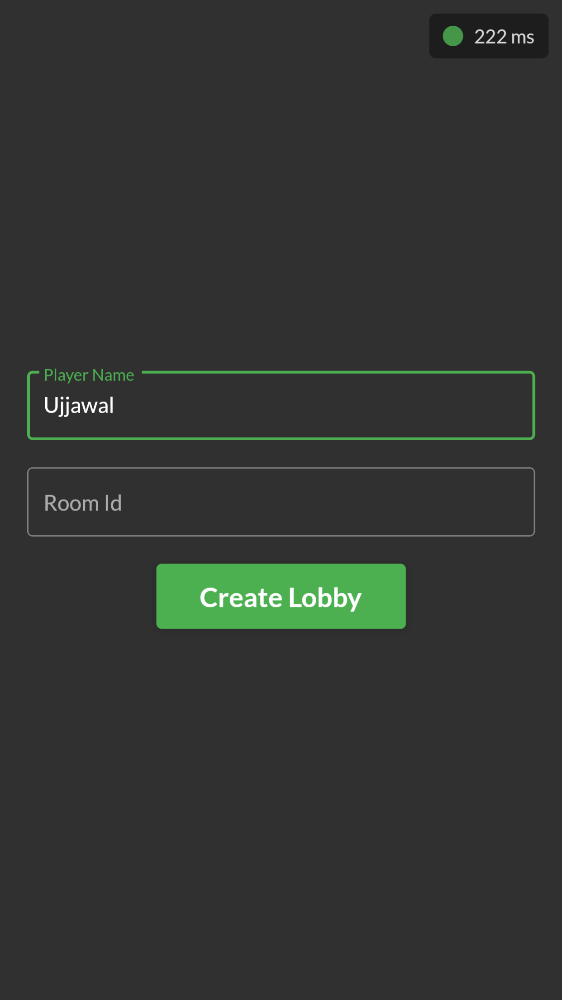
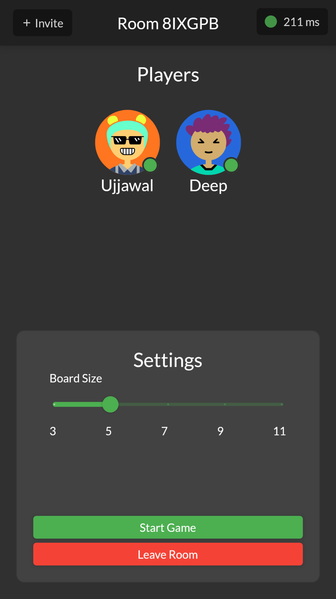
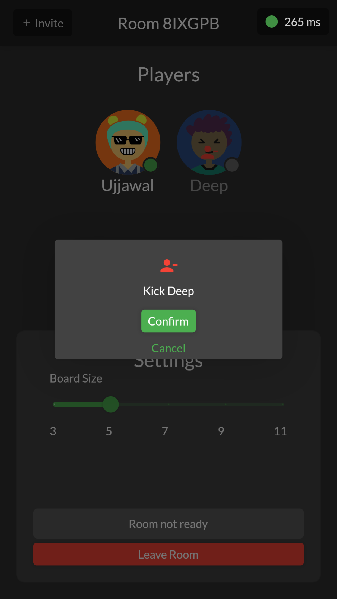
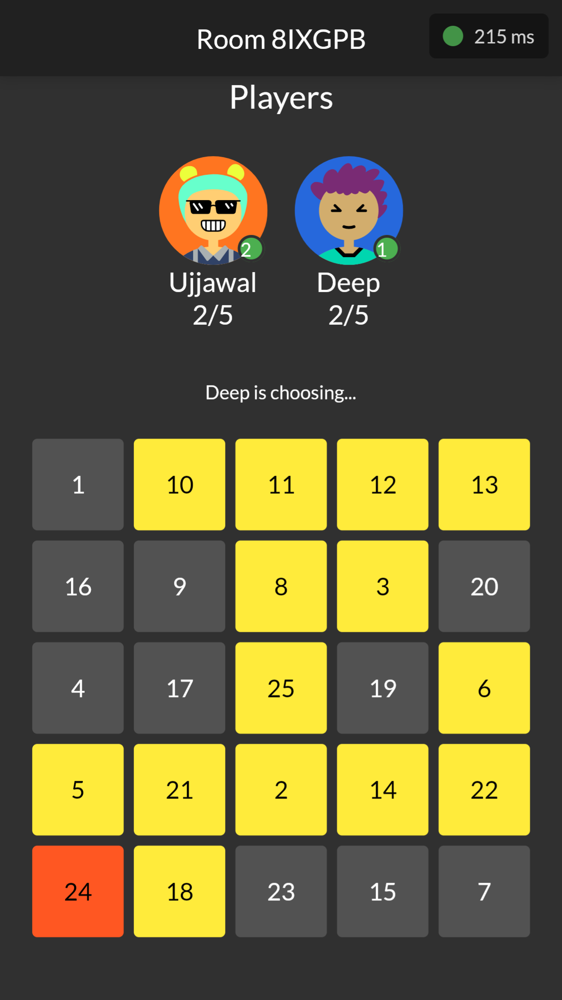
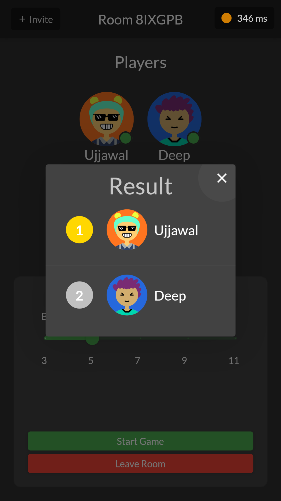

<h2 align="center"><b>Bingo Tingo</b></h2>

<h4 align="center">A multiplayer web game to play with your friends!</h4>

 

 

## Screenshots

 

## Description

 

## Features

 

## License

Bingo Tingo is Free Software: You can use, study share and improve it at your
will. Specifically you can redistribute and/or modify it under the terms of the
[GNU General Public License](https://www.gnu.org/licenses/gpl.html) as
published by the Free Software Foundation, either version 3 of the License, or
(at your option) any later version.
